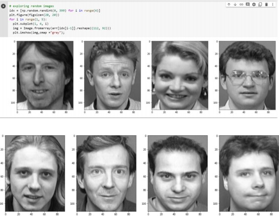
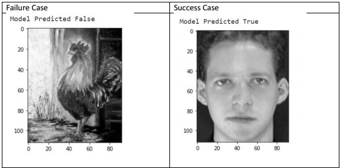
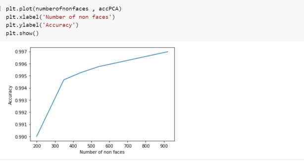

# Face-Recognition
Implementing a face recognition model from scratch, implementing PCA, LDA, KNN

There are ten different images of each of 40 distinct subjects. For some subjects, the images were taken at different times, varying the lighting, facial expressions (open / closed eyes, smiling / not smiling) and facial details (glasses / no glasses). 
All the images were taken against a dark homogeneous background with the subjects in an upright, frontal position (with tolerance for some side movement). The files are in PGM format. The size of each image is 92x112 pixels, with 256 grey levels per pixel. The images are organized in 40 directories (one for each 
subject), which have names of the form sX, where X indicates the subject number (between 1 and 40). In each of these directories, there are ten different images of that subject, which have names of the form Y.pgm, where Y is the image number for that subject (between 1 and 10).

### Let's take a look at the images

### Dimensionality Reduction
The dataset was of size 40*10304 so we had to perform dimensionality reduction, so to do that we used PCA and LDA and compared their results

### Prediction using KNN
Then we implemented the KNN model to predict which image belongs to which class
We obtained 94.5 on reduced data from PCA and 96.5 on reduced data from LDA with KNN k = 1
Then we downloaded some non face images like airplanes, animals and birds to be able to classify an image as a face or non face

but dueto the nature of the dataset we had some failure and success cases as shown:

As we increase the size of the dataset the higher the accuracy we were able to obtain

